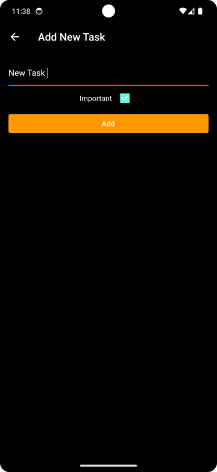

# Todo App


A simple and elegant Todo app to help you stay organized and manage your tasks efficiently.


Stay organized and boost productivity with our sleek and intuitive Todo app. Easily add, manage, and prioritize tasks, ensuring nothing slips through the cracks. With features like task tagging, due dates, and completion tracking, keeping on top of your to-do list has never been easier. Embrace efficiency and stay focused on what matters most with our Todo app.

## Features

- Add, edit, and delete tasks.
- Mark tasks as completed.
- Categorize tasks with tags and due dates.
- Filter tasks based on their status (All, Completed, Pending).
- Responsive design for seamless usage on different devices.

## Screenshots

<div style="display: flex; justify-content: space-between;">
  
  
</div>

## Technologies Used

- Flutter: A cross-platform mobile app development framework.
- Provider: For state management and data sharing.
- Responsive Design: Utilizing Flutter's layout widgets for a consistent UI on various devices.

## Installation

1. Clone the repository:

```bash
git clone https://github.com/mrtann17/todo-app.git
cd todo-app
